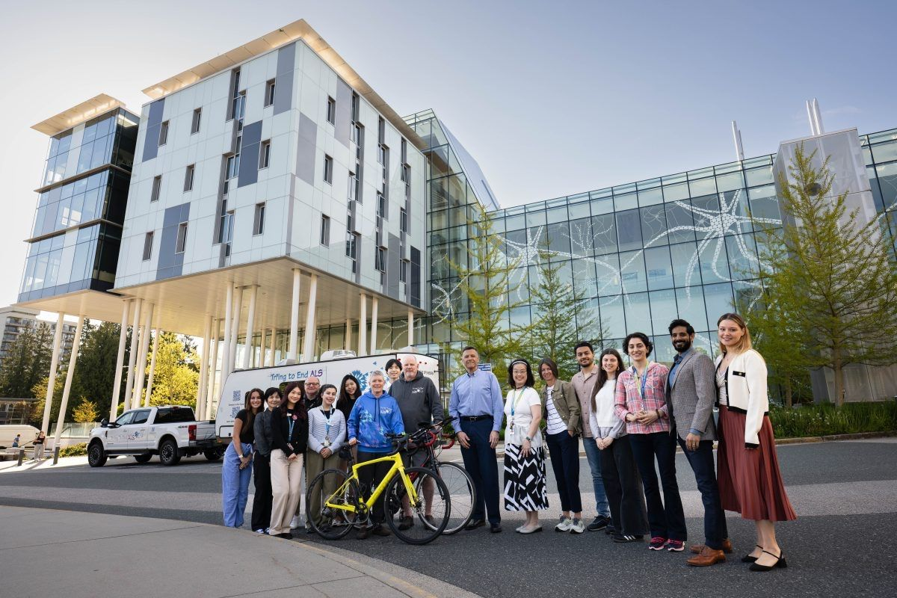

# News

# Research Highlighted by ALS Canada

Our research was featured in the [April 2025 Research Update](https://als.ca/news/research-update-april-2025/) by ALS Canada.

This work focuses on using MRI-based texture analysis on 1.5 Tesla MRI along with the D50 model to better understand disease progression in ALS. We remain committed to advancing research that can ultimately lead to better diagnosis, stratification, and treatment strategies for ALS.

Thank you to ALS Canada for supporting.

*Read the full update [here](https://als.ca/news/research-update-april-2025/).*

---

# Tri’ing to End ALS

This summer, Donna Bartel and Mike Pearson are taking on a massive challenge: 17 triathlons across Canada in just four months to try and raise $600,000 to end ALS. 

Half of the funds will support local ALS societies, while the other half will go towards PROJECT HOPE at UBC, where Dr. Erik P Pioro leads groundbreaking research and care for patients with ALS and related disorders.

*Learn more and support Donna and Mike's journey: [here](https://www.centreforbrainhealth.ca/news/triing-to-end-als-one-race-at-a-time/).*

Photo of the UBC ALS and Related Disorders Clinical and Research Team by Paul H. Joseph

